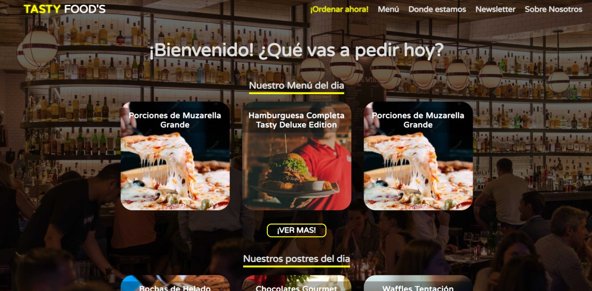

## Website - Tastyfood's Restaurant

Link: https://tastyfood-restaurant-proyect.netlify.app/

---

---

## Tecnologías utilizadas

- HTML5
- CSS3
- Javascript
- Netlify (para CI/CD)

### Autor: [Nicolas Vargas](https://www.linkedin.com/in/nicolas-vargas-software-engineer/), Proyecto Codo a Codo 4.0 (2022)

---
## Propósito de la web

Esta pagina web esta principalmente orientada al uso por parte de restaurantes u otras industrias del rubro gastronómico que puedan ofrecer un delivery y que gran parte de su negocio sea a través de este servicio. Es decir, además de darle exposición al local, **la web se enfoca en conseguir que el cliente ordene de manera online**.

---

## Logica para conseguir el objetivo

Como el objetivo es conseguir el pedido del cliente, existen varios botones Call to Action para que pueda ordenar. Todos los botones apuntan al Whatsapp del restaurante, con un mensaje precargado.

Si el cliente no hace click en el boton de la primer seccion pero sigue bastante interesado como para explorar la pagina, va a seguir leyendo, y los contenidos presentes van a cumplir el rol de generar el momentum para que el cliente "tenga más ganas" de ordenar. Al llegar a la ultima sección de la pagina, se va a encontrar con el newsletter, donde podrá recibir un descuento + Free Delivery si decide suscribirse. De esta forma podremos obtener su email para el posterior email marketing.

---

## Diseño

Para la estructura del proyecto se eligió el modelo **Single Page Application**, con 8 secciones. Es un template **mobile-first** **responsive** creado desde 0, sin usar frameworks de CSS.
